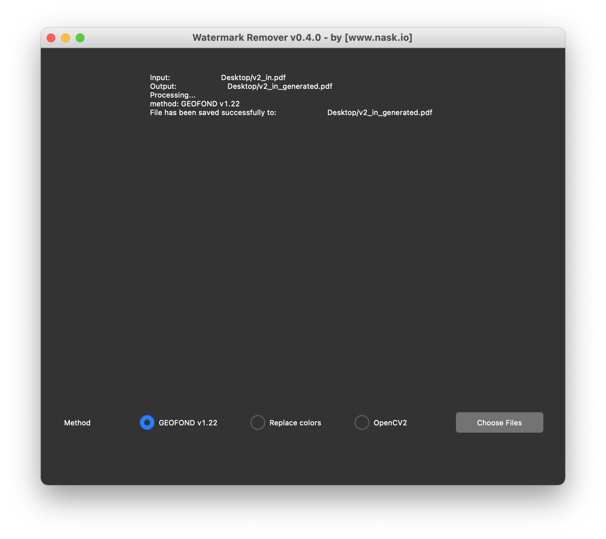

# watermark-remover

Python GUI to remove watermarks from images, docx and pdf files.

## Getting Started

### Install

Download the latest release from [GitHub releases](https://github.com/naskio/watermark-remover/releases) and run it.

## Contributing

[Pull requests](https://github.com/naskio/watermark-remover/pulls) are welcome! For any bug reports, please create
an [issue](https://github.com/naskio/watermark-remover/issues).

Start by reading the [contributor guideline](CONTRIBUTING.md).

## License

[License](LICENSE)